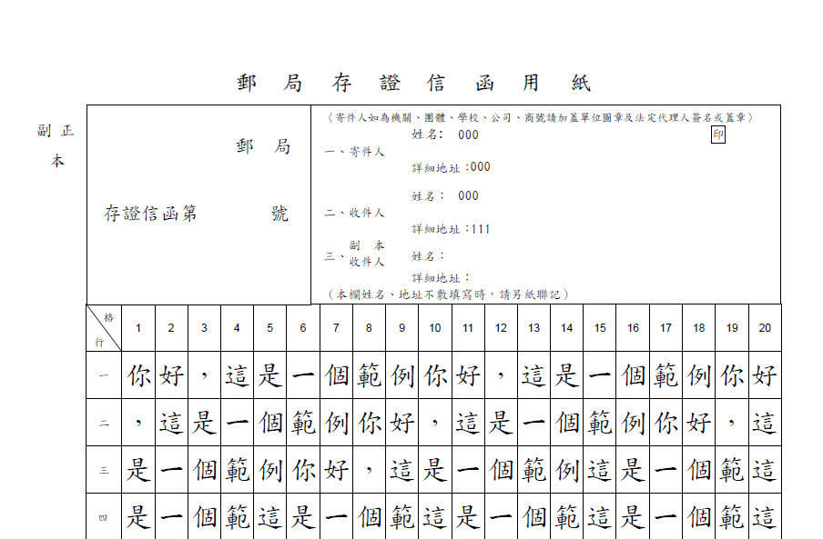
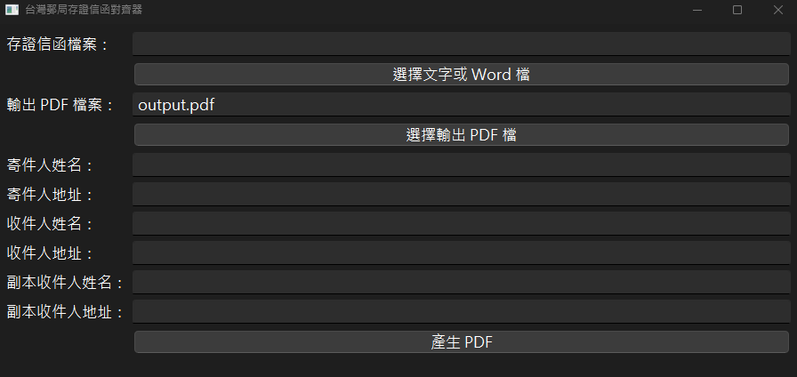

---

# Legal Attest Letter Alignment - Taiwan

## 台灣郵局存證信函對齊器 (PDF 格式)

A tool for creating a legal attest letter of Taiwan - in PDF format.

一款用於生成台灣郵局存證信函的工具，輸出為 PDF 格式。

---

## 關於 About

**Legal Attest Letter Alignment - Taiwan** 是一款專為台灣郵局存證信函設計的工具，透過簡化信函生成流程，並提供便利的介面，以利法律界初學者減少繁瑣的排版時間，並以 PDF 格式保存或打印。

---

## 重要聲明

**Legal Attest Letter Alignment - Taiwan** 是基於 [Legal Attest Letter Generator - Taiwan](https://github.com/csterryliu/Legal-Attest-Letter-Generator-TW) 進行改進與擴充。本項目在原有功能的基礎上進行依賴以及UI的現代化，並支援 Word 檔案、可選擇 PDF 輸出路徑等多項新功能，以提供更佳的使用體驗。

---

## 功能 Features

### 1. 輸出整齊、美觀的信函
The output is neat and beautiful.


### 2. 可編輯姓名、地址至存證信函對應位置
You can edit names and addresses in the right positions.

### 3. 支援 Word 檔案與純文字檔案
Supports both Word (`.doc`, `.docx`) and plain text (`.txt`) files.

### 4. 可選擇 PDF 輸出路徑
Allows users to choose the download path for the generated PDF.

### 5. 高級華麗的圖形介面
Advanced and elegant graphical user interface built with PySide6.

### 6. 免費離線使用
You can use it offline for free.

### 7. 開源：程式實作完全開放閱覽，無隱私問題，過程完全透明
Open source: You are free to read the code. No privacy issues. The process is totally transparent.

---

## 下載最新版本 Download The Latest Version

請前往 [Releases](https://github.com/show940125/Legal-Attest-Letter-Alignment-TW/releases) 下載最新版本的執行檔。

Please visit [Releases](https://github.com/show940125/Legal-Attest-Letter-Alignment-TW/releases) to download the latest version of the executable.

---

## 如何使用 How To Use It

### 圖形介面版 GUI Version

1. **啟動程式**  
   雙擊下載後的 `main_qt.exe` 以啟動圖形介面。

2. **選擇存證信函內容檔案**  
   點擊「選擇文字或 Word 檔」，選取你的 `.txt`、`.doc` 或 `.docx` 文件。

3. **選擇輸出 PDF 路徑**  
   點擊「選擇輸出 PDF 檔案」，選擇你希望儲存 PDF 的位置及檔名。

4. **填寫寄件人與收件人資訊**  
   在相應的欄位填寫寄件人姓名、寄件人地址、收件人姓名及收件人地址。

5. **產生 PDF**  
   點擊「產生 PDF」按鈕，程式將自動生成格式化好的 PDF 信函。

6. **完成通知**  
   產生成功後，會彈出通知告知 PDF 已成功產生。

### 命令列版 Command-Line Version

若你更偏好使用命令列，也可以按照以下步驟進行：

1. **打開終端機（Command Prompt 或 PowerShell）**  
2. **執行以下指令**  
   ```bash
   python main_qt.py your_article.txt \
     --senderName "張三" \
     --senderAddr "台北市信義區XX路1號" \
     --receiverName "李四" \
     --receiverAddr "台中市北區XX街9巷" \
     --outputFileName "my_output.pdf"
   ```
   將上述指令中的參數替換為你的實際需求。

---

## 安裝與執行 Installation and Execution

### 圖形介面版 GUI Version

1. **下載執行檔**  
   前往 [Releases](https://github.com/show940125/Legal-Attest-Letter-Alignment-TW/releases) 下載最新的 `main_qt.exe`。

2. **執行程式**  
   雙擊 `main_qt.exe`，即可啟動圖形介面，按照「如何使用」部分的指引操作。

### 開發者版 Developer Version

若你希望自行編輯或擴充功能，請按照以下步驟設置開發環境：

1. **克隆倉庫 Clone the Repository**  
   ```bash
   git clone https://github.com/show940125/Legal-Attest-Letter-Alignment-TW.git
   cd Legal-Attest-Letter-Alignment-TW
   ```

2. **建立並啟動虛擬環境 Create and Activate Virtual Environment**  
   ```bash
   python -m venv venv
   # 啟動虛擬環境
   # Windows
   venv\Scripts\activate
   # macOS/Linux
   source venv/bin/activate
   ```

3. **安裝相依套件 Install Dependencies**  
   ```bash
   pip install --upgrade pip
   pip install -r requirements.txt
   ```

4. **執行程式 Run the Application**  
   ```bash
   python main_qt.py
   ```

---

## 相依套件 Dependencies

以下是此專案所需的主要 Python 套件：

- **PyPDF2** >= 3.0.1  
  處理 PDF 讀寫的核心套件。

- **reportlab** 4.2.5  
  用於生成 PDF 的高級排版套件。

- **PySide6**  
  建立圖形介面的強大框架。

- **docx2txt**  
  轉換 Word (`.doc`, `.docx`) 檔案為純文字。

- **其他套件**  
  若有其他依賴，請參閱 `requirements.txt`。

---

## 安裝方式 Installation

1. **克隆倉庫 Clone the Repository**  
   ```bash
   git clone https://github.com/show940125/Legal-Attest-Letter-Alignment-TW.git
   cd Legal-Attest-Letter-Alignment-TW
   ```

2. **建立並啟動虛擬環境 Create and Activate Virtual Environment**  
   ```bash
   python -m venv venv
   # 啟動虛擬環境
   # Windows
   venv\Scripts\activate
   # macOS/Linux
   source venv/bin/activate
   ```

3. **安裝相依套件 Install Dependencies**  
   ```bash
   pip install --upgrade pip
   pip install -r requirements.txt
   ```

---

## 使用範例 Usage Examples

### 圖形介面版 GUI Version

1. 啟動程式，選擇你的存證信函檔案。
2. 指定 PDF 的輸出路徑。
3. 填寫寄件人與收件人的姓名與地址。
4. 點擊「產生 PDF」，等待完成。

### 命令列版 Command-Line Version

```bash
python main_qt.py sample_article.txt \
  --senderName "王小明" \
  --senderAddr "彰化縣某地" \
  --receiverName "李小華" \
  --receiverAddr "高雄市某區" \
  --outputFileName "my_output.pdf"
```

---

## 版本相容性 Version Compatibility

- **Python 版本**  
  支援 Python 3.8 及以上版本。

- **作業系統**  
  主要在 Windows 10/11 上測試通過，其他作業系統尚未全面支援。

---

## 貢獻指南 Contributing

歡迎任何對專案感興趣的朋友提出建議、報告問題或貢獻程式碼。請先閱讀 [CONTRIBUTING.md](https://github.com/show940125/Legal-Attest-Letter-Alignment-TW/blob/main/CONTRIBUTING.md) 了解詳細流程。

---

## 授權條款 License

本專案採用 [Apache License](https://github.com/show940125/Legal-Attest-Letter-Alignment-TW/blob/main/LICENSE) 授權條款。詳情請參閱 LICENSE 檔案。

---

## 聯絡方式 Contact

若有任何問題、建議或合作意向，歡迎透過 [Issues](https://github.com/show940125/Legal-Attest-Letter-Alignment-TW/issues) 與我們聯繫。

---

## 規範 Standards

本專案遵循 [PEP 8](https://pep8.org/) 風格指南，確保程式碼整潔、一致且易於維護。

---

## 參考資源 References

- [PyPDF2 Documentation](https://pypdf2.readthedocs.io/en/latest/)
- [ReportLab Documentation](https://www.reportlab.com/docs/reportlab-userguide.pdf)
- [PySide6 Documentation](https://doc.qt.io/qtforpython/)
- [docx2txt Documentation](https://github.com/ankushshah89/python-docx2txt)

---
